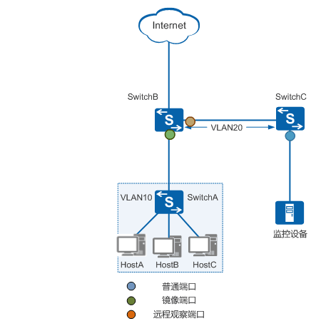

# 端口镜像 :id=mirror

镜像是指将经过指定端口（源端口或者镜像端口）的报文复制一份到另一个指定端口（目的端口或者观察端口）。

---

## 目的 :id=aim

在网络运营与维护的过程中，为了便于业务监测和故障定位，网络管理员时常要获取设备上的业务报文进行分析。

镜像可以在不影响设备对报文进行正常处理的情况下，将镜像端口的报文复制一份到观察端口。网络管理员通过网络监控设备就可以分析从观察端口复制过来的报文，判断网络中运行的业务是否正常。

---

## 基本概念 :id=concept

### 镜像端口和观察端口 :id=port

*   镜像端口：是指被监控的端口，镜像端口收发的报文将被复制一份到与监控设备相连的端口。
    
*   观察端口：是指连接监控设备的端口，用于将镜像端口复制过来的报文发送给监控设备。
    
    一般观察端口专门用于镜像流量的转发，因此不建议在上面配置其他业务，防止镜像流量与其他业务流量在观察端口上同时转发会互相影响。
    

在设备上应用镜像功能时，如果镜像过多，会占用较多的设备内部转发带宽，可能影响其他业务转发。另外，如果镜像端口与观察端口的带宽不一致，比如，镜像端口的带宽是 1000Mbit/s，观察端口的带宽是 100Mbit/s，则有可能导致观察端口因带宽不足而不能及时转发全部的镜像报文，发生丢包情况。

### 镜像方向 :id=direction

镜像方向是指将镜像端口指定方向的报文复制到观察端口，包括：

*   入方向：将镜像端口接收的报文复制到观察端口上。
*   出方向：将镜像端口发送的报文复制到观察端口上。
*   双向：将镜像端口接收和发送的报文都复制到观察端口上。

---

## 端口镜像 :id=port-mirror

端口镜像是指设备复制从镜像端口流经的报文，并将此报文传送到指定的观察端口进行分析和监控。端口镜像根据监控设备在网络中位置的不同，分为本地端口镜像和远程端口镜像。

### 本地端口镜像 :id=local-port-mirror

本地端口镜像是指观察端口与监控设备直接相连，此时观察端口被称为本地观察端口。

### 远程端口镜像 :id=remote-port-mirror

远程端口镜像是指观察端口与监控设备通过中间网络传输镜像报文，此时观察端口被称为远程观察端口。

二层远程端口镜像是指远程观察端口与监控设备通过一个二层网络相连。如下图所示，二层远程端口镜像中镜像报文的具体转发过程如下。

图：二层远程端口镜像示意图

1.  镜像端口将流经的原始报文复制到远程观察端口。
2.  远程观察端口收到镜像端口复制过来的镜像报文，在原来的 VLAN 标签（VLAN10）外层再添加一层 VLAN 标签（VLAN20），以便将镜像报文向中间二层网络转发。值得注意的是，这一步不需要通过端口加入 VLAN 来完成，是直接通过配置远程观察端口来实现的。
3.  SwitchC 在接收到远程观察端口发来的镜像报文后，就将镜像报文向监控设备转发。为了实现这一步，需要将中间二层设备（SwitchC）与远程观察端口、监控设备相连的端口加入 VLAN20，保证 tchB、SwitchC 与监控设备间能够二层通信。

---

## 流镜像 :id=flow-mirror

流镜像是指在设备上配置一定的规则，将符合规则的特定业务流复制到观察端口进行分析和监控。

---

## VLAN 镜像 :id=vlan-mirror

VLAN 镜像是指将指定 VLAN 内所有活动接口的报文镜像到观察端口。用户可以对某个 VLAN 或者某些 VLAN 内的报文进行监控。

同端口镜像类似，根据监控设备在网络中位置的不同，VLAN 镜像也可以分为本地 VLAN 镜像和远程 VLAN 镜像。值得注意的是，远程 VLAN 镜像中，主机所在 VLAN 和用于转发镜像报文的中间二层网络的 VLAN 不能相同。

--- 

## MAC 镜像 :id=mac-mirror

MAC 镜像是指将 VLAN 内匹配指定源或者目的 MAC 地址的报文镜像到观察端口。MAC 地址镜像提供了一种更加精确的镜像方式，用户可以对网络中特定设备的报文进行监控。

!> 一般观察端口专门用于镜像流量的转发，因此不建议在上面配置其他业务，防止镜像流量与其他业务流量在观察端口上同时转发会互相影响。
