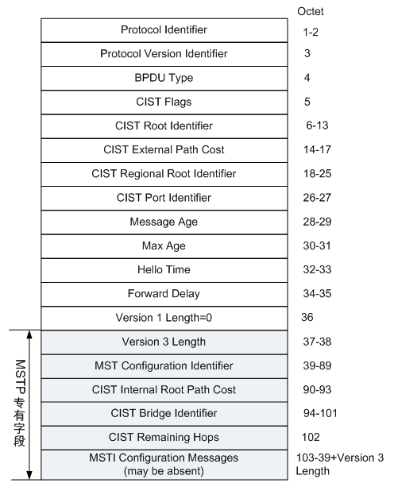
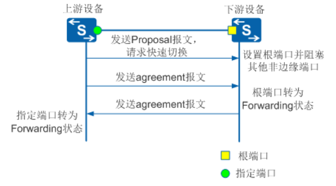
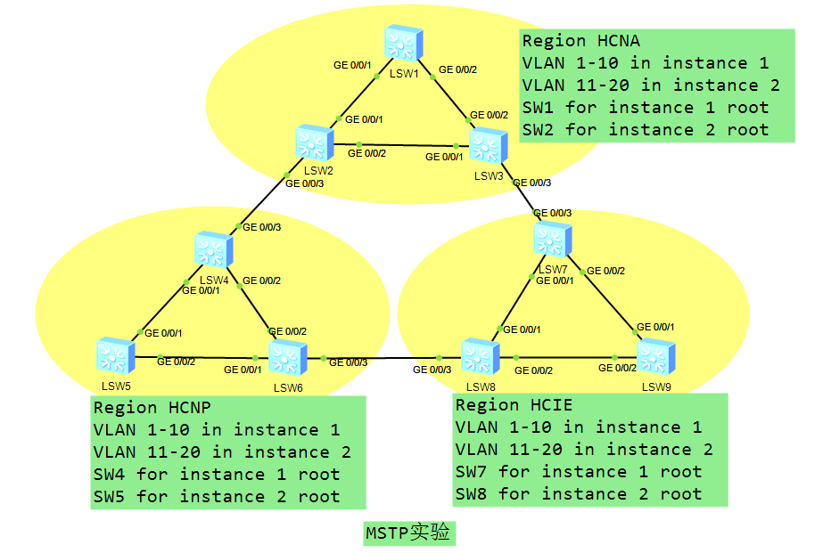

# MSTP 多区域生成树协议 :id=mstp

多生成树协议 MSTP（Multiple Spanning Tree Protocol）是 IEEE 802.1s 中定义的生成树协议，通过生成多个生成树，来解决以太网环路问题。

-----------------

## 目的 :id=aim

在以太网中部署 MSTP 协议后可实现如下功能：

*   形成多棵无环路的树，解决广播风暴并实现冗余备份。
*   多棵生成树在 VLAN 间实现负载均衡，不同 VLAN 的流量按照不同的路径转发。

---------------------------------------------

## STP/RSTP 的缺陷 :id=defects

RSTP 在 STP 基础上进行了改进，实现了网络拓扑快速收敛。但 RSTP 和 STP 还存在同一个缺陷：由于局域网内所有的 VLAN 共享一棵生成树，因此无法在 VLAN 间实现数据流量的负载均衡，链路被阻塞后将不承载任何流量，还有可能造成部分 VLAN 的报文无法转发。

----------------------------------------------------------------

## MSTP 对 STP 和 RSTP 的改进 :id=advantage

*   为了弥补 STP 和 RSTP 的缺陷，IEEE 于 2002 年发布的 802.1S 标准定义了 MSTP。MSTP 兼容 STP 和 RSTP，既可以快速收敛，又提供了数据转发的多个冗余路径，在数据转发过程中实现 VLAN 数据的负载均衡。
*   MSTP 把一个交换网络划分成多个域，每个域内形成多棵生成树，生成树之间彼此独立。每棵生成树叫做一个多生成树实例 MSTI（Multiple Spanning Tree Instance），每个域叫做一个 MST 域（MST Region：Multiple Spanning Tree Region）。
*   所谓生成树实例就是多个 VLAN 的一个集合。通过将多个 VLAN 捆绑到一个实例，可以节省通信开销和资源占用率。MSTP 各个实例拓扑的计算相互独立，在这些实例上可以实现负载均衡。可以把多个相同拓扑结构的 VLAN 映射到一个实例里，这些 VLAN 在端口上的转发状态取决于端口在对应 MSTP 实例的状态。

------------------------------------

## MSTP 基本概念 :id=concept

*   **MST 域（MST Region）**
    
    ​ 都启动了 MSTP。
    
    *   具有相同的域名。
    *   具有相同的 VLAN 到生成树实例映射配置。
    *   具有相同的 MSTP 修订级别配置。
    
    一个局域网可以存在多个 MST 域，各 MST 域之间在物理上直接或间接相连。用户可以通过 MSTP 配置命令把多台交换设备划分在同一个 MST 域内。
    
*   **VLAN 映射表：**
    
    VLAN 映射表是 MST 域的属性，它描述了 VLAN 和 MSTI 之间的映射关系。
    
*   **CST**
    
    公共生成树 CST（Common Spanning Tree）是连接交换网络内所有 MST 域的一棵生成树。
    
    如果把每个 MST 域看作是一个节点，CST 就是这些节点通过 STP 或 RSTP 协议计算生成的一棵生成树。
    
*   **IST**
    
    内部生成树 IST（Internal Spanning Tree）是各 MST 域内的一棵生成树。
    
    IST 是一个特殊的 MSTI，MSTI 的 ID 为 0，通常称为 MSTI0。
    
    IST 是 CIST 在 MST 域中的一个片段。
    
*   **SST**
    
    运行 STP 或 RSTP 的交换设备只能属于一个生成树。
    
    MST 域中只有一个交换设备，这个交换设备构成单生成树。
    
*   CIST
    
    公共和内部生成树 CIST（Common and Internal Spanning Tree）是通过 STP 或 RSTP 协议计算生成的，连接一个交换网络内所有交换设备的单生成树。
    
*   **域根**
    
    域根（Regional Root）分为 IST 域根和 MSTI 域根。
    
    一个 MST 域内可以生成多棵生成树，每棵生成树都称为一个 MSTI。MSTI 域根是每个多生成树实例的树根。
    
*   **总根**
    
    总根是 CIST（Common and Internal Spanning Tree）的根桥。
    
*   **主桥**
    
    主桥（Master Bridge）也就是 IST Master，它是域内距离总根最近的交换设备。
    
*   **端口角色**
    
    根端口、指定端口、Alternate 端口、Backup 端口和边缘端口的作用同 RSTP 协议中定义。
    
    除边缘端口外，其他端口角色都参与 MSTP 的计算过程。
    
    同一端口在不同的生成树实例中可以担任不同的角色。
    
-----------------------

## 端口角色 :id=port-role

| 端口角色 | 说明 |
| --- | --- |
| 根端口 | 在非根桥上，离根桥最近的端口是本交换设备的根端口。根交换设备没有根端口。根端口负责向树根方向转发数据。 |
| 指定端口 | 对一台交换设备而言，它的指定端口是向下游交换设备转发 BPDU 报文的端口。 |
| Alternate 端口 | 从配置 BPDU 报文发送角度来看，`Alternate` 端口就是由于学习到其它网桥发送的配置 BPDU 报文而阻塞的端口。 从用户流量角度来看，`Alternate` 端口提供了从指定桥到根的另一条可切换路径，作为根端口的备份端口。 |
| Backup 端口 | 从配置 BPDU 报文发送角度来看，`Backup` 端口就是由于学习到自己发送的配置 BPDU 报文而阻塞的端口。 从用户流量角度来看，`Backup` 端口作为指定端口的备份，提供了另外一条从根节点到叶节点的备份通路。 |
| Master 端口 | 1、 `Master` 端口是 MST 域和总根相连的所有路径中最短路径上的端口，它是交换设备上连接 MST 域到总根的端口。 2、 `Master` 端口是域中的报文去往总根的必经之路。 3、 `Master` 端口是特殊域边缘端口，`Master` 端口在 CIST 上的角色是 Root Port，在其它各实例上的角色都是 `Master` 端口。 |
| 域边缘端口 | 域边缘端口是指位于 MST 域的边缘并连接其它 MST 域或 SST 的端口。 |
| 边缘端口 | 1、如果指定端口位于整个域的边缘，不再与任何交换设备连接，这种端口叫做边缘端口。2、 边缘端口一般与用户终端设备直接连接。 3、 端口使能 MSTP 功能后，会默认启用边缘端口自动探测功能，当端口在（2 × Hello Timer + 1）秒的时间内收不到 BPDU 报文，自动将端口设置为边缘端口，否则设置为非边缘端口。 |

-----------------------

## 端口状态 :id=port-status

MSTP 定义的端口状态与 RSTP 协议中定义相同。

注：根端口、Master 端口、指定端口和域边缘端口支持 `Forwarding`、`Learning` 和 `Discarding` 状态，Alternate 端口和 Backup 端口仅支持 `Discarding` 状态。

------------------------------

## MSTP 报文 :id=mstp-pkt

MSTP 使用多生成树桥协议数据单元 MST BPDU（Multiple Spanning Tree Bridge Protocol Data Unit）作为生成树计算的依据。MST BPDU 报文用来计算生成树的拓扑、维护网络拓扑以及传达拓扑变化记录。

STP 中定义的配置 BPDU、RSTP 中定义的 RST BPDU、MSTP 中定义的 MST BPDU 及 TCN BPDU 差异对比如下：

**四种 BPDU 差异比较：**

| 版本 | 类型 | 名称 |
| --- | --- | --- |
| 0 | 0x00 | 配置 BPDU |
| 0 | 0x80 | TCN BPDU |
| 2 | 0x02 | RST BPDU |
| 3 | 0x02 | MST BPDU |

### MSTP 帧格式 :id=mstp-pkt-struct

图：MSTP 帧格式

无论是域内的 MST BPDU 还是域间的，前 35 个字节和 RST BPDU 相同。

从第 36 个字节开始是 MSTP 专有字段。最后的 MSTI 配置信息字段由若干 MSTI 配置信息组连缀而成。

### MSTP 报文字段解释 :id=pkt-field

| 字段 | 说明 |
| --- | --- |
| Protocol Identifier | 协议标识符。 |
| Protocol Version Identifier | 协议版本标识符，STP 为 0，RSTP 为 2，MSTP 为 3。 |
| BPDU Type | BPDU 类型，MSTP 为 0x02。0x00：STP 的 Configuration BPDU0x80：STP 的 TCN BPDU（Topology Change Notification BPDU）0x02：RST BPDU（Rapid Spanning-Tree BPDU）或者 MST BPDU（Multiple Spanning-Tree BPDU） |
| CIST Flags | CIST 标志字段。 |
| CIST Root Identifier | CIST 的总根交换机 ID。 |
| CIST External Path Cost | CIST 外部路径开销指从本交换机所属的 MST 域到 CIST 根交换机的累计路径开销。CIST 外部路径开销根据链路带宽计算。 |
| CIST Regional Root Identifier | CIST 的域根交换机 ID，即 IST Master 的 ID。 如果总根在这个域内，那么域根交换机 ID 就是总根交换机 ID。 |
| CIST Port Identifier | 本端口在 IST 中的指定端口 ID。 |
| Message Age | BPDU 报文的生存期。 |
| Max Age | BPDU 报文的最大生存期，超时则认为到根交换机的链路故障。 |
| Hello Time | Hello 定时器，缺省为 2 秒。 |
| Forward Delay | Forward Delay 定时器，缺省为 15 秒。 |
| Version 1 Length | Version1 BPDU 的长度，值固定为 0。 |
| Version 3 Length | Version3 BPDU 的长度。 |
| MST Configuration Identifier | MST 配置标识，表示 MST 域的标签信息，包含 4 个字段：Configuration Identifier Format Selector：固定为 0。Configuration Name：“域名”，32 字节长字符串。Revision Level：2 字节非负整数。Configuration Digest：利用 HMAC-MD5 算法将域中 VLAN 和实例的映射关系加密成 16 字节的摘要。只有 MST Configuration Identifier 中的四个字段完全相同的，并且互联的交换机，才属于同一个域。 |
| CIST Internal Root Path Cost | CIST 内部路径开销指从本端口到 IST Master 交换机的累计路径开销。CIST 内部路径开销根据链路带宽计算。 |
| CIST Bridge Identifier | CIST 的指定交换机 ID。 |
| CIST Remaining Hops | BPDU 报文在 CIST 中的剩余跳数。 |
| MSTI Configuration Messages (may be absent) | MSTI 配置信息。每个 MSTI 的配置信息占 16 bytes，如果有 n 个 MSTI 就占用 n×16bytes。单个 MSTI Configuration Messages 的字段说明如下：MSTI Flags：MSTI 标志。MSTI Regional Root Identifier：MSTI 域根交换机 ID。MSTI Internal Root Path Cost：MSTI 内部路径开销指从本端口到 MSTI 域根交换机的累计路径开销。MSTI 内部路径开销根据链路带宽计算。MSTI Bridge Priority：本交换机在 MSTI 中的指定交换机的优先级。MSTI Port Priority：本交换机在 MSTI 中的指定端口的优先级。MSTI Remaining Hops：BPDU 报文在 MSTI 中的剩余跳数。 |

### MSTP 报文格式可配置 :id=pkt-type

目前 MSTP 的 BPDU 报文存在两种格式：

*   dot1s：IEEE802.1s 规定的报文格式。
*   legacy：私有协议报文格式。

如果端口收发报文格式为默认支持 dot1s 或者 legacy，这样就存在一个缺点：需要人工识别对端的 BPDU 报文格式，然后手工配置命令来决定支持哪种格式。人工识别报文格式比较困难，且一旦配置错误，就有可能导致 MSTP 计算错误，出现环路。端口收发 MSTP 报文格式可配置（stp compliance）功能，能够实现对 BPDU 报文格式的自适应。

### 每个 Hello Time 时间内端口最多能发送 BPDU 的报文数可配置 :id=bpdu-num-per-hello

Hello Time 用于生成树协议定时发送配置消息维护生成树的稳定。如果交换设备在一段时间内没有收到 BPDU 报文，则会由于消息超时而对生成树进行重新计算。

当交换设备成为根交换设备时，该交换设备会按照该设置值为时间间隔发送 BPDU 报文。非根交换设备采用根交换设备所设置的 Hello Time 时间值。

每个 Hello Time 时间内端口最多能够发送的 BPDU 报文个数可配置（Max Transmitted BPDU Number in Hello Time is Configurable）功能，可以设定当前端口在 Hello Time 时间内配置 BPDU 的最大发送数目。

用户配置的数值越大，表示每 Hello Time 时间内发送的报文数越多。适当的设置该值可以限制端口每 Hello Time 时间内能发送的 BPDU 数目，防止在网络拓扑动荡时，BPDU 占用过多的带宽资源。

------------------------------------

## MSTP 拓扑计算 :id=mstp-topo

MSTP 可以将整个二层网络划分为多个 MST 域，各个域之间通过计算生成 CST。域内则通过计算生成多棵生成树，每棵生成树都被称为是一个多生成树实例。其中实例 0 被称为 IST，其他的多生成树实例为 MSTI。MSTP 同 STP 一样，使用配置消息进行生成树的计算，只是配置消息中携带的是设备上 MSTP 的配置信息。

### 优先级向量 :id=pri

MSTI 和 CIST 都是根据优先级向量来计算的，这些优先级向量信息都包含在 MST BPDU 中。各交换设备互相交换 MST BPDU 来生成 MSTI 和 CIST。

*   优先级向量简介
    
    *   参与 CIST 计算的优先级向量为：
        
        {根交换设备 ID，外部路径开销，域根 ID，内部路径开销，指定交换设备 ID，指定端口 ID，接收端口 ID}
        
    *   参与 MSTI 计算的优先级向量为：
        
        {域根 ID，内部路径开销，指定交换设备 ID，指定端口 ID，接收端口 ID}
        
    
>括号中的向量的优先级从左到右依次递减。
    

**向量说明：**

| 向量名 | 说明 |
| --- | --- |
| 根交换设备 ID | 根交换设备 ID 用于选择 CIST 中的根交换设备。根交换设备 ID = Priority(16bits) + MAC(48bits)。其中 Priority 为 MSTI0 的优先级。 |
| 外部路径开销（ERPC） | 从 CIST 的域根到达总根的路径开销。MST 域内所有交换设备上保存的外部路径开销相同。若 CIST 根交换设备在域中，则域内所有交换设备上保存的外部路径开销为 0。 |
| 域根 ID | 域根 ID 用于选择 MSTI 中的域根。域根 ID = Priority(16bits) + MAC(48bits)。其中 Priority 为 MSTI0 的优先级。 |
| 内部路径开销（IRPC） | 本桥到达域根的路径开销。域边缘端口保存的内部路径开销大于非域边缘端口保存的内部路径开销。 |
| 指定交换设备 ID | CIST 或 MSTI 实例的指定交换设备是本桥通往域根的最邻近的上游桥。如果本桥就是总根或域根，则指定交换设备为自己。 |
| 指定端口 ID | 指定交换设备上同本设备上根端口相连的端口。Port ID = Priority(4 位) + 端口号（12 位）。端口优先级必须是 16 的整数倍。 |
| 接收端口 ID | 接收到 BPDU 报文的端口。Port ID = Priority(4 位) + 端口号（12 位）。端口优先级必须是 16 的整数倍。 |

*   比较原则
    
    同一向量比较，值最小的向量具有最高优先级。
    
    优先级向量比较原则如下。
    
    1.  首先，比较根交换设备 ID。
    2.  如果根交换设备 ID 相同，再比较外部路径开销。
    3.  如果外部路径开销相同，再比较域根 ID。
    4.  如果域根 ID 仍然相同，再比较内部路径开销。
    5.  如果内部路径仍然相同，再比较指定交换设备 ID。
    6.  如果指定交换设备 ID 仍然相同，再比较指定端口 ID。
    7.  如果指定端口 ID 还相同，再比较接收端口 ID。
    
    如果端口接收到的 BPDU 内包含的配置消息优于端口上保存的配置消息，则端口上原来保存的配置消息被新收到的配置消息替代。端口同时更新交换设备保存的全局配置消息。反之，新收到的 BPDU 被丢弃。
    

### CIST 中端口角色的选举 :id=port-vote

1、比价 CIST 的总根 ID，越小越优。  
2、比较 CIST 到达总根的 ERPC，越小越优。  
3、比较 CIST 域根的 BID，越小越优。  
4、比较 CIST 到达域根的 IPRC，越小越优。  
5、比较 CIST 中 BPDU 报文发送者的 BID，越小越优。  
6、比较 CIST 中 BPDU 报文发送者的 PID，越小越优。  
7、比较 CIST 中 BPDU 报文接收者的 PID，越小越优。

### CIST 的计算 :id=cist-calc

经过比较配置消息后，在整个网络中选择一个优先级最高的交换设备作为 CIST 的树根。在每个 MST 域内 MSTP 通过计算生成 IST；同时 MSTP 将每个 MST 域作为单台交换设备对待，通过计算在 MST 域间生成 CST。CST 和 IST 构成了整个交换设备网络的 CIST。

### MSTI 的计算 :id=msti-calc

在 MST 域内，MSTP 根据 VLAN 和生成树实例的映射关系，针对不同的 VLAN 生成不同的生成树实例。每棵生成树独立进行计算，计算过程与 STP 计算生成树的过程类似。

**MSTI 的特点：**

*   每个 MSTI 独立计算自己的生成树，互不干扰。
*   每个 MSTI 的生成树计算方法与 STP 基本相同。
*   每个 MSTI 的生成树可以有不同的根，不同的拓扑。
*   每个 MSTI 在自己的生成树内发送 BPDU。
*   每个 MSTI 的拓扑通过命令配置决定。
*   每个端口在不同 MSTI 上的生成树参数可以不同。
*   每个端口在不同 MSTI 上的角色、状态可以不同。

*   在 MST 域内，沿着其对应的 MSTI 转发。
*   在 MST 域间，沿着 CST 转发。

### MSTP 对拓扑变化的处理 :id=topo-change

MSTP 拓扑变化处理与 RSTP 拓扑变化处理过程类似。

在 RSTP 中检测拓扑是否发生变化只有一个标准：一个非边缘端口迁移到 Forwarding 状态。

*   为本交换设备的所有非边缘指定端口启动一个 TC While Timer，该计时器值是 Hello Time 的两倍。
    
    在这个时间内，清空所有端口上学习到的 MAC 地址。
    
    同时，由非边缘端口向外发送 RST BPDU，其中 TC 置位。一旦 TC While Timer 超时，则停止发送 RST BPDU。
    
*   其他交换设备接收到 RST BPDU 后，清空所有端口学习到 MAC 地址，除了收到 RST BPDU 的端口。然后也为自己所有的非边缘指定端口和根端口启动 TC While Timer，重复上述过程。
    

如此，网络中就会产生 RST BPDU 的泛洪。

------------------------------------------

## MSTP 快速收敛机制 :id=time

MSTP 支持普通方式和增强方式两种 P/A（Proposal/Agreement）机制：

*   普通方式
    
    MSTP 支持普通方式的 P/A 机制实现与 RSTP 支持的 P/A 机制实现相同。
    
*   增强方式
    
    

图：增强方式的 P/A 机制

在 MSTP 中，P/A 机制工作过程如下：

*   上游设备发送 Proposal 报文，请求进行快速迁移。下游设备接收到后，把与上游设备相连的端口设置为根端口，并阻塞所有非边缘端口。
*   上游设备继续发送 Agreement 报文。下游设备接收到后，根端口转为 Forwarding 状态。
*   下游设备回应 Agreement 报文。上游设备接收到后，把与下游设备相连的端口设置为指定端口，指定端口进入 Forwarding 状态。

缺省情况下，华为数据通信设备使用增强的快速迁移机制。如果华为数据通信设备和其他制造商的设备进行互通，而其他制造商的设备 P/A 机制使用普通的快速迁移机制，此时，可在华为数据通信设备上通过设置 P/A 机制为普通的快速迁移机制，从而实现华为数据通信设备和其他制造商的设备进行互通。

---------------------------------

## MSTP 多进程 :id=multiprocess

MSTP 多进程是基于 MSTP 协议的增强性技术。此技术可将二层交换设备上的端口绑定到不同的进程中，并以进程为单位进行 MSTP 协议计算，不在同一个进程内的端口不参与此进程中的 MSTP 协议计算，从而实现各个进程内的生成树计算相互独立，互不影响。

MSTP 多进程机制并不只限于 MSTP 协议，RSTP 和 STP 协议同样适用。

### 优势 :id=mp-adv

通过部署 MSTP 多进程可实现如下：

*   极大地提升了在不同组网条件下生成树协议的可部署性。
    
    为了保证运行不同类型生成树协议的网络可靠运行，可将不同类型的生成树协议划分到不同的进程中，不同进程对应的网络进行独立的生成树协议计算。
    
*   增强了组网的可靠性，对于大量的二层接入设备，可减少单台设备故障对整个网络的冲击。
    
    通过进程隔离不同的拓扑计算，即某台设备故障只影响其所在的进程对应的拓扑，不会影响其他进程拓扑计算。
    
*   网络扩容时，可减少网络管理者维护量，从而提升了用户运维管理的方便性。
    
    当网络扩容时，只需要划分新的进程与原有网络对接，不需要调整原有网络的 MSTP 进程配置。如果是某个进程中进行了设备扩容，此时也只需要针对扩容的进程进行修改，而不需要调整其他进程中的配置。
    
*   实现二层端口分割管理
    
    每个 MSTP 进程可以管理设备上的部分端口，即设备的二层端口资源被多个 MSTP 进程分割管理，每个 MSTP 进程上均可运行标准的 MSTP。

