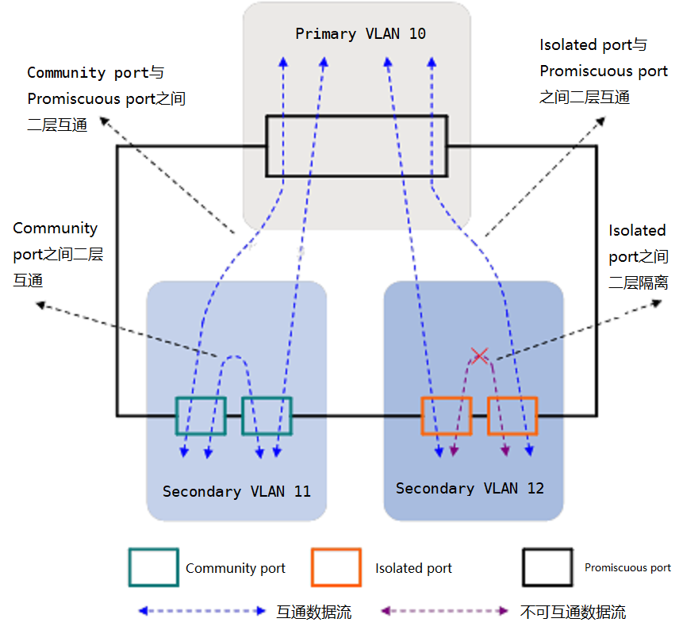

# MUX VLAN :id=mux-vlan

MUX VLAN（Multiplex VLAN）提供了一种通过VLAN进行网络资源控制的机制。

例如，在企业网络中，企业员工和企业客户可以访问企业的服务器。对于企业来说，希望企业内部员工之间可以互相交流，而企业客户之间是隔离的，不能够互相访问。

# 分类 :id=mux-vlan-classify

+ 主VLAN（Principal VLAN）
  
  Principal port可以和MUX VLAN内的所有接口进行通信。

+ 隔离型从VLAN（Separate VLAN）
  
  Separate port只能和Principal port进行通信，和其他类型的接口实现完全隔离。
  
  每个隔离型从VLAN必须绑定一个主VLAN。

+ 互通型从VLAN（Group VLAN）
  
  Group port可以和Principal port进行通信，在同一组内的接口也可互相通信，但不能和其他组接口或Separate port通信。

  每个互通型从VLAN必须绑定一个主VLAN。

---

# PVLAN :id=pvlan

由一组VLAN集构成，包括1个Primary VLAN和其对应的Secondary VLAN。

## Primary VLAN :id=primary-vlan

上行设备感知的用户VLAN，它并不是用户的真正VLAN。

## Secondary VLAN :id=secondary-vlan

用户真正属于的VLAN。

Secondary VLAN有两种类型：Community VLAN和Isolated VLAN。

同一Community VLAN内的下行端口（又称为Community port）可以互通，同一Isolated VLAN内的下行端口（又称为Isolated port）相互隔离。

缺省情况下，Secondary VLAN为Community VLAN。

## 工作模式 :id=pvlan-mode

+ 下行端口
  + Host工作模式
    + 与用户相连，负责和终端通信。
    + 需确保其缺省VLAN为Secondary VLAN，否则无法转发来自Primary VLAN的报文。
    + 适用于只有一个Secondary VLAN通过下行端口的情况，该模式下Secondary VLAN不带Tag通过下行端口。
  + Trunk secondary工作模式
    + 用于和下行设备相连。
    + 报文携带的Primary VID在端口出方向上会替换为对应Secondary VID，从而对于下行设备屏蔽了Primary VLAN。
    + Trunk secondary模式的端口，对于同一个Primary VLAN只能加入一个Secondary VLAN，但可加入多个不同Primary VLAN对应的Secondary VLAN。
    + 适用于需要多个Secondary VLAN通过下行端口的情况，携带Secondary VID通过下行端口。  

+ 上行端口
  + Promiscuous工作模式
    + 用于和上行设备相连，负责和上行设备通信。
    + 需确保其缺省VLAN为Primary VLAN，否则该端口无法转发来自Secondary VLAN的报文。
    + 适用于只有一个Primary VLAN通过上行端口的情况，该模式下Primary VLAN不带Tag通过上行端口。
  + Trunk pomiscuous工作模式
    + 用于和上行设备相连。
    + 报文携带的Secondary VLAN ID在端口出方向上会替换为对应Primary VLAN ID，从而对于上行设备屏蔽了Secondary VLAN。
    + Trunk promiscuous模式适用于多个Primary VLAN携带Tag通过上行端口。

