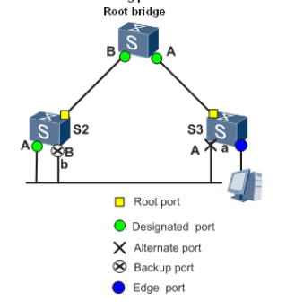
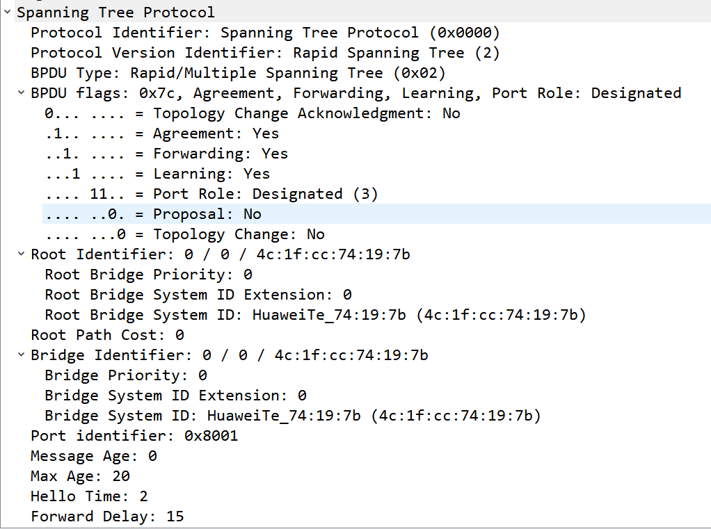
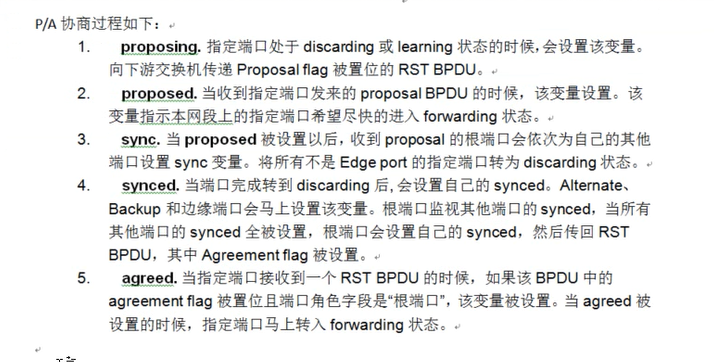
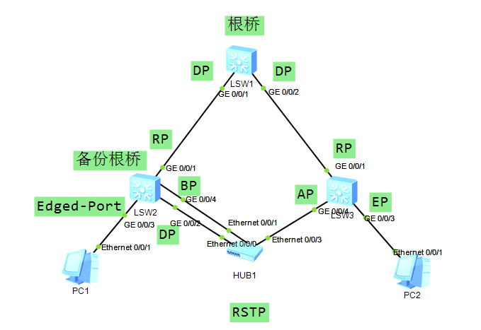

# RSTP 快速生成树协议

------------

## RSTP 概述

快速生成树协议 RSTP（Rapid Spanning Tree Protocol）在 STP 基础上实现了快速收敛，并增加了边缘端口的概念及保护功能。

---------------------------------------

## RSTP 的端口角色

RSTP 在 STP 基础上新增加了 2 种端口角色：Backup 端口和边缘端口。通过端口角色的增补，简化了生成树协议的理解及部署。

*   Backup 端口：由于学习到自己发送的配置 BPDU 报文而阻塞的端口，指定端口的备份，提供了另外一条从根节点到叶节点的备份通路。
*   边缘端口：如果端口位于整个交换区域边缘，不与任何交换设备连接，这种端口叫做边缘端口。边缘端口一般与用户终端设备直接连接。

图：RSTP 端口角色示意图

--------------------------------

## 边缘端口的特点

1.  边缘端口会节省 30S 的延时，端口 UP 后会立即进入转发状态。
2.  边缘端口的 UP/DOWN 不会触发拓扑改变。
3.  边缘端口收的 TC 置为的配置 BPDU 报文不会将 MAC 地址的老化时间设置为 15s。
4.  边缘端口如果收到配置的 BPDU 报文会马上变为一个普通端口，进行 STP 的收敛
5.  边缘端口也会发送配置 BPDU 报文。
6.  PA 协商不会阻塞边缘端口。

---------------------------------------

## RSTP 的端口状态

RSTP 的端口状态在 STP 的基础上进行了改进。由原来的五种缩减为三种。

| 端口状态 | 说明 |
| --- | --- |
| Forwarding（转发） | 在这种状态下，端口既转发用户流量又处理 BPDU 报文。 |
| Learning（学习） | 这是一种过渡状态。在 Learning 下，交换设备会根据收到的用户流量，构建 MAC 地址表，但不转发用户流量，所以叫做学习状态。Learning 状态的端口处理 BPDU 报文，不转发用户流量。 |
| Discarding(丢弃) | Discarding 状态的端口只接收 BPDU 报文。 |

------------------------------------

## RSTP 报文格式

在 BPDU 的格式上，除了保证和 STP 格式基本一致之外，RSTP 作了一些小的变化。一个是在 Type 字段，配置 BPDU 类型不再是 0 而是 2，版本号也变成了 2。所以运行 STP 的交换机收到该类 BPDU 时会丢弃。

另一个变化是在 Flag 字段，把原来保留的中间 6 位使用起来。这样改变了的配置 BPDU 叫做 RST BPDU。

RSTP Flag 字段格式：

*   Bit7：TCA
*   Bit6：Agreement
*   Bit5：Forwarding
*   Bit4：Learning
*   Bit3 和 Bit2：端口角色
    *   00：未知
    *   01：根端口
    *   10：Alternate / Backup
    *   11：指定端口
*   Bit1：Proposal
*   Bit0：TC

------------------------------------------

## RSTP 报文抓包示例

图：RSTP 报文抓包示例

---------------------------

## P/A 协商

针对运行 STP 设备从初始化到完全收敛至少需要 30s 的问题，RSTP 采用 P/A（Proposal/agreement）协商机制。

-----------------

## 特点

由于有来回确认机制和同步变量机制，就无需依靠计时器来保障无环。可以让交换机的互联接口快速进入转发模式。

### P/A 协商的硬件条件

只能应用在点到点的链路上（全双工的端口），如果是半双工端口会识别为共享（share）链路，在共享链路上不能使用 P/A 协商。

### P/A 协商的过程

1.  SW1 向 SW2 发送 p 置位的 BPDU 包。
2.  同步变量（阻塞除边缘端口以外的其他端口，防止出现环路）。
3.  SW2 向 SW1 发送 A 置位的 BPDU 包。
4.  SW1 收到 A 置位的 BPDU 包后，端口立即进入 Forwarding 状态。（一般都是秒级）

### P/A 协商的详细过程

图：P/A 协商的详细过程

### 什么情况下 RSTP 报文中需要将 Proposal 位置位？

一个指定端口进入 discarding 或者 learning 状态，需要将 proposal 位置位。

------------------------------------------------

## RSTP 中收敛时间的优化

1.  P/A 协商：可以让交换机的 RP 和 DP 的互联接口快速进入转发状态。
2.  直连故障：AP 口变为 RP 并快速进入转发状态，不需要 30s 延时。
3.  次优场景：AP 口收到次优的 RST BPDU 包后会马上变为 RP 口，并向该端口发送最优的 RST BPDU 包。
4.  非直连链路故障：连续丢失 3 个 RST BPDU 包，端口角色就需切换，最长时间为 6s。
5.  RSTP 中 TC 置位的 RST BPDU 包所有桥设备都可以发送，连续发送 4s（TC while 时间）。

### 在 RSTP 中什么情况下才会发送 TC BPDU 包？

指定端口进入到转发状态。

### MAC 地址表的清除

*   TC 发送者：清除除了边缘端口以为的其它端口的 MAC 地址绑定条目。
*   TC 接受者：清除除了 TC 报文接口端口和边缘端口以外的其它端口的 MAC 地址绑定条目。

> 在 RSTP 中非根桥也会每隔 hello timer 主动发送 RsT BPDU 报文，不是由根桥来发。
> 
> 在 RSTP 中 DP 口 shutdown 后 BP 口的角色会马上变为 DP 口，并经过 30s 的转发延时进入到转发状态。

| 保护功能 | 场景 | 配置影响 |
| --- | --- | --- |
| BPDU（Bridge Protocol Data Unit）保护 | 边缘端口在收到 BPDU 以后端口状态将变为非边缘端口，此时就会造成生成树的重新计算，如果攻击者伪造配置消息恶意攻击交换设备，就会引起网络震荡。 | 交换设备上启动了 BPDU 保护功能后，如果边缘端口收到 RST BPDU，边缘端口将被 error-down，但是边缘端口属性不变，同时通知网管系统。被 error-down 的边缘端口只能由网络管理员手动恢复。如果用户需要被 error-down 的边缘端口可自动恢复，可通过配置使能端口自动恢复功能，并可设置延迟时间。 |
| 防 TC-BPDU 报文攻击保护 | 交换设备在接收到拓扑变化报文后，会执行 MAC 地址表项和 ARP 表项的删除操作，如果频繁操作则会对 CPU 的冲击很大。 | 启用防 TC-BPDU 报文攻击功能后，在单位时间内，交换设备处理拓扑变化报文的次数可配置。如果在单位时间内，交换设备在收到拓扑变化报文数量大于配置的阈值，那么设备只会处理阈值指定的次数。对于其他超出阈值的拓扑变化报文，定时器到期后设备只对其统一处理一次。这样可以避免频繁的删除 MAC 地址表项和 ARP 表项，从而达到保护设备的目的。 |
| Root 保护 | 由于维护人员的错误配置或网络中的恶意攻击，根桥收到优先级更高的 BPDU，会失去根桥的地位，重新进行生成树的计算，并且由于拓扑结构的变化，可能造成高速流量迁移到低速链路上，引起网络拥塞。 | 对于启用 Root 保护功能的指定端口，其端口角色只能保持为指定端口。一旦启用 Root 保护功能的指定端口收到优先级更高的 RST BPDU 时，端口状态将进入 Discarding 状态，不再转发报文。在经过一段时间（通常为两倍的 Forward Delay），如果端口一直没有再收到优先级较高的 RST BPDU，端口会自动恢复到正常的 Forwarding 状态。 |
| 环路保护 | 当出现链路拥塞或者单向链路故障，根端口和 Alternate 端口会老化。根端口老化，会导致系统重新选择根端口（而这有可能是错误的），Alternate 端口老化，将迁移到 Forwarding 状态，这样会产生环路。 | 在启动了环路保护功能后，如果根端口或 Alternate 端口长时间收不到来自上游设备的 BPDU 报文时，则向网管发出通知信息（此时根端口会进入 Discarding 状态，角色切换为指定端口），而 Alternate 端口则会一直保持在阻塞状态（角色也会切换为指定端口），不转发报文，从而不会在网络中形成环路。直到链路不再拥塞或单向链路故障恢复，端口重新收到 BPDU 报文进行协商，并恢复到链路拥塞或者单向链路故障前的角色和状态。 |
  
如下图，SW1 配置为根桥，并且配置了根保护功能。SW2 配置为备份根桥，连接 PC 的端口配置为边缘端口。SW3 连接 PC 的端口配置为边缘端口，并配置 BPDU 过滤。

图：RSTP 配置拓扑

