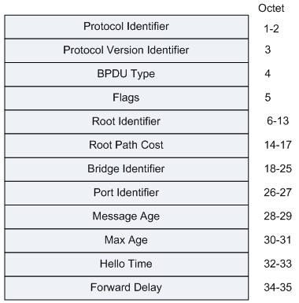
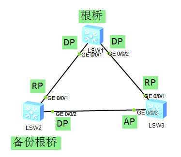

# STP 生成树协议 :id=stp

---------

## STP 概述 :id=introduction

生成树协议 STP（Spanning Tree Protocol）将环形网络修剪成为一个无环的树型网络，避免报文在环形网络中的增生和无限循环。

在一个复杂的网络环境中，难免会出现环路。由于冗余备份的需要，网络设计者都倾向于在设备之间部署多条物理链路，其中一条作主用链路，其他链路作备份，这样都有可能会导致环路产生。

环路会产生广播风暴，最终导致整个网络资源被耗尽，网络瘫痪不可用。环路还会引起 MAC 地址表震荡导致 MAC 地址表项被破坏。

为了破除环路，可以采用数据链路层协议 STP，运行该协议的设备通过彼此交互信息发现网络中的环路，并有选择的对某个端口进行阻塞，最终将环形网络结构修剪成无环路的树形网络结构，从而防止报文在环形网络中不断循环，避免设备由于重复接收相同的报文造成处理能力下降。

---------------------------------

## STP 相关概念 :id=concept

*   根桥
    
    树形网络结构必须有树根，于是 STP/RSTP 引入了根桥（Root Bridge）概念。
    
    对于一个 STP/RSTP 网络，根桥有且只有一个，它是整个网络的逻辑中心，但不一定是物理中心。但是根据网络拓扑的变化，根桥可能改变。
    
*   BID（Bridge ID）：桥 ID
    
    IEEE 802.1d 标准中规定 BID 是由 2 字节的桥优先级（Bridge Priority）与桥 MAC 地址构成，即 BID（8 字节） = 桥优先级（2 字节） + 桥 MAC（6 字节）。
    
    在 STP 网络中，桥 ID 最小的设备会被选举为根桥。
    
*   PID（Port ID）：端口 ID
    
    PID 由两部分构成的，即 PID（16 位） = 端口优先级（4 位） + 端口号（12 位）。
    
    PID 只在某些情况下对选择指定端口有作用，即在选择指定端口时，两个端口的根路径开销和发送交换设备 BID 都相同的情况下，比较端口的 PID，PID 小者为指定端口。
    
*   路径开销（RPC）
    
    路径开销是 STP/RSTP 协议用于选择链路的参考值。STP/RSTP 协议通过计算路径开销，选择较为 “强壮” 的链路，阻塞多余的链路，将网络修剪成无环路的树形网络结构。根设备的端口的路径开销都为 0。
    
    在一个 STP/RSTP 网络中，某端口到根桥累计的路径开销就是所经过的各个桥上的各端口的开销。
    
*   PC（port cost）
    
    PC 的计算需要依据端口带宽来计算。
    

### 端口角色 :id=port-role

*   根端口（RP）：
    
    即去往根桥路径最近的端口。根端口负责向根桥方向转发数据，根端口同时还负责接收上游设备的 BPDU 报文和用户流量转发。根端口的选择标准是依据根路径开销判定。在一台设备上所有使能 STP 的端口中，根路径开销最小者，就是根端口。在一个运行 STP/RSTP 协议的设备上根端口有且只有一个，而且根桥上没有根端口。
    
*   指定端口（DP）：
    
    对一台交换设备而言，它的指定端口是向下游交换设备转发 BPDU 报文的端口。根桥的所有端口都是指定端口。在环网的每一网段都会选举出一个指定端口，在一个网段上拥有指定端口的交换设备被称作该网段的指定桥。
    
*   替代端口（AP）：
    
    由于学习到其它设备发送的配置 BPDU 报文而阻塞的端口，作为根端口的备份端口，提供了从指定桥到根的另一条可切换路径。
    

### 端口状态 :id=port-status

| 端口状态 | 目的 | 说明 |
| --- | --- | --- |
| Forwarding（转发） | 端口既转发用户流量也处理 BPDU 报文。 | 只有根端口或指定端口才能进入 Forwarding 状态。 |
| Learning(学习) | 设备会根据收到的用户流量构建 MAC 地址表，但不转发用户流量。 | 过渡状态，增加 Learning 状态防止临时环路。（15s） |
| Listening（监听） | 确定端口角色，将选举出根桥、根端口和指定端口。 | 过渡状态。（15s） |
| Blocking（阻塞） | 端口紧紧接收并处理 BPDU 报文，不转发用户流量 | 阻塞端口的最终状态。 |
| Disabled（禁用） | 端口既不处理 BPDU 报文，也不转发用户流量。 | 端口状态为 Down。 |

### 三种定时器 :id=timer

| 定时器类型 | 说明 |
| --- | --- |
| Hello Time | Hello Timer 定时器时间的大小控制配置 BPDU 发送间隔。 |
| Forward Delay Timer | Forward Delay Timer 定时器时间的大小控制端口在 Listening 和 Learning 状态的持续时间。 |
| Max Age | Max Age 定时器时间的大小控制存储配置 BPDU 的超时时间，超时认为根桥连接失败。 |

---------------------------------

## STP 报文格式 :id=packet

图：STP 报文格式

-----------------------------

## 报文字段解释 :id=field

| 字段内容 | 说明 |
| --- | --- |
| Protocol Identifier | 协议 ID＝“0” |
| Protocol Version Identifier | 协议版本标识符，STP 为 0，RSTP 为 2，MSTP 为 3。 |
| BPDU Type | BPDU 类型，MSTP 为 0x02。0x00：STP 的 Configuration BPDU0x80：STP 的 TCN BPDU（Topology Change Notification BPDU）0x02：RST BPDU（Rapid Spanning-Tree BPDU）或者 MST BPDU（Multiple Spanning-Tree BPDU） |
| Flags | 对于 “标记域”（Flags），第一个 bit（左边、高位 bit）表示 “TCA（拓扑改变响应）”，最后一个 bit（右边、低位 bit）表示 “TC（拓扑改变）”。 |
| Root Identifier | 网桥 ID 都是 8 个字节——前两个字节是网桥优先级，后 6 个字节是网桥 MAC 地址。 |
| Root Path Cost | 根路径开销，本端口累计到根桥的开销。 |
| Bridge Identifier | 发送者 BID，本交换机的 BID。 |
| Port Identifier | 发送端口 PID，发送该 BPDU 的端口 ID。 |
| Message Age | 该 BPDU 的消息年龄。 |
| Max Age | 消息老化年龄。 |
| Hello Time | 发送两个相邻 BPDU 间的时间间隔。 |
| Forward Delay | 控制 Listening 和 Learning 状态的持续时间。 |

---------------------------

## STP 原理 :id=principle

找到冗余的一端，然后阻塞端口，避免环路。

---------------------------

## STP 版本 :id=version

1.  IEEE 802.1D STP
2.  IEEE802.1W RSTP
3.  IEEE802.1S MSTP

------------------------------------

## STP 的选举过程 :id=vote

1.  在一个交换网络中选举一个根桥，根桥是设备的概念。
    
2.  根桥选举后，交换网络中的其他设备都是非根桥，每个非根桥还需选取一个到达根桥最短路径的端口称为根端口。
    
    注：非根桥只能有一个根端口。
    
3.  每条链路上，还需选举一个指定端口，默认情况下根桥的所有端口都是指定端口。
    
4.  既不是根端口，也不是指定端口的其他端口需要被阻塞，不能转发数据帧。
    
--------------------------

## 根桥的选举 :id=rb-vote

1.  通过比较 BID 选举，优选 BID 小的。BID 由优先级 + MAC 地址组成。
2.  首先比较优先级，优先级越小越优。
3.  如果优先级一样，比较 MAC 地址，MAC 地址越小越优。

--------------------------------

## 指定端口的选举 :id=ap-vote

1.  比较 RID，优选小的。
2.  比较到达根桥的 RPC（Root Path Cost），越小越优。
3.  比较 BPDU 包发送者的 BID，越小越优。
4.  比较 BPDU 包发送者的 PID，越小越优。
5.  比较 BPDU 包接收者的 PID，越小越优。

---------------------------------------------

## BPDU 报文的两种类型 :id=bpdu-type

*   配置 BPDU
    
    包含了桥 ID，路径开销，端口 ID 等参数。
    
*   TCN BPDU
    
    指下游交换机感知到拓扑发生变化时向上游交换机发送的拓扑变化通知。用以快速刷新 MAC 地址表。
    
---------------------------

## STP 故障 :id=issue

*   根桥故障
    
    非根桥会在 BPDU 老化之后，开始根桥的重新选举。
    
*   直连链路故障
    
    交换机检测到直连链路故障后，会将预备端口转换为根端口。
    
    预备端口会在 30s 后恢复到转发状态。
    
*   间接链路故障
    
    间接链路故障进入到转发状态需要 50s（MAX age + Forwarding delay * 2）。
    
*   拓扑改变导致 MAC 地址表错误
    
    MAC 地址默认老化时间为 300s，这段时间内无法转发数据。
    
------------------------------------------------

## STP 用于拓扑改变的报文 :id=change-pkt

*   TCN BPDU 报文：拓扑改变通知。
    
*   TCN BPDU 报文只能由非根桥发出，通告给根桥。
    
*   TCA BPDU 报文：用于确认接收到的 TCN PBDU 报文。
    
*   TC BPDU 报文：只能由根桥发起，连续发送 35s（MAX age + Forwarding delay）。
    
    非根桥收到 TC BPDU 报文后会将 MAC 地址的老化时间设置为 15s，加速老化。
    
---------------------------------

## STP 拓扑改变 :id=change

1.  如果非根桥上发生拓扑变化，向根桥发送 TCN BPDU 包，通告根桥拓扑已改变。
2.  上联的非根桥从指定端口收到 TCN BPDU 包后，会向发送者回复 TCA flag 位置位的配置 BPDU 包，同时继续向根桥发送 TCN BPDU 包。
3.  根桥收到 TCN BPDU 包后，向发送者回复 TCA Flag 位置位的配置 BPDU 包，同时向所有指定端口发送 TC Flag 位置位的配置 BPDU 包。TC 置位的配置 BPDU 包会连续发送 35s，同时将自己的 MAC aging 设置为 15s。
4.  其他非根桥收到 TC 置位的配置 BPDU 包后，将自己的 MAC 地址的老化时间设置为 15s，加速老化。

---------------------------------------------

## STP 触发拓扑改变条件 :id=condition

1.  一个端口从 forwarding 状态过渡到 disable 或 blocking 状态。
2.  一个非根桥如果从指定端口接收到 TCN BPDU 包，需要向根桥装发 TCN BPDU 包。
3.  一个端口进入转发状态，并且本地已存在一个指端端口。

如下图，需将 SW1 配置为根桥，SW2 配置为备份根桥。通过在三台交换机中配置 STP，对某个端口进行阻塞，防止网络出环。

图：STP 配置拓扑

