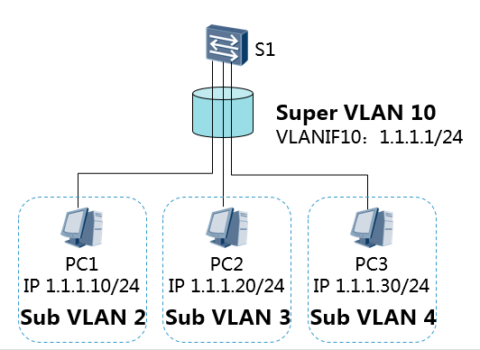
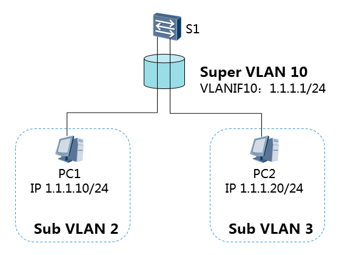
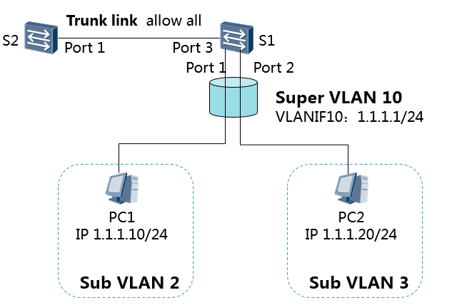

# VLAN聚合 :id=vlan-aggregation

---

## 基本概念 :id=concept

VLAN Aggregation（VLAN 聚合，也称 Super VLAN）技术就是在一个物理网络内，用多个 VLAN 隔离广播域，使不同的 VLAN 属于同一个子网，同时可以节约IP网段。

*   Super-VLAN：和通常意义上的 VLAN 不同，它只建立三层接口，与该子网对应，而且不包含物理端口。可以把它看作一个逻辑的三层概念——若干 Sub-VLAN 的集合。
*   Sub-VLAN：只包含物理端口，用于隔离广播域的 VLAN，不能建立三层 VLAN 接口。它与外部的三层交换是靠 Super-VLAN 的三层接口来实现的。
*   一个 Super-VLAN 可以包含一个或多个保持着不同广播域的 Sub-VLAN。Sub-VLAN 不再占用一个独立的子网网段。在同一个 Super-VLAN 中，无论主机属于哪一个 Sub-VLAN，它的 IP 地址都在 Super-VLAN 对应的子网网段内。

---

## 通信原理 :id=communication

### Sub-VLAN 间三层通信 :id=subvlan-communication

*   使能 Sub-VLAN 间的 ARP Proxy 功能，实现 Sub-VLAN 间互通。

*   Super-VLAN（VLAN10）包含 Sub-VLAN（VLAN2 和 VLAN3）
*   上述拓扑假设 S1 已经开启了 Sub-VLAN 间的 ARP Proxy 功能，通信过程如下：
    *   PC1 将 PC2 的 IP 地址（1.1.1.20）和自己所在网段 1.1.1.0/24 进行比较，发现 PC2 和自己在同一个子网，但是 PC1 的 ARP 表中无 PC2 的对应表项。
    *   PC1 发送 ARP 广播，请求 PC2 的 MAC 地址。
    *   PC2 并不在 VLAN2 的广播域内，无法接收到 PC1 的这个 ARP 请求。
    *   由于网关上使能 Sub-VLAN 间的 ARP Proxy，当网关收到 PC1 的 ARP 请求后，开始在路由表中查找，发现 ARP 请求中的 PC2 的 IP 地址（1.1.1.20）为直连接口路由，则网关向所有其他 Sub-VLAN 接口发送一个 ARP 广播，请求 PC2 的 MAC 地址。
    *   PC2 收到网关发送的 ARP 广播后，对此请求进行 ARP 应答。
    *   网关收到 PC2 的应答后，就把自己的 MAC 地址当作 PC2 的 MAC 地址回应给 PC1。
    *   网关和 PC1 的 ARP 表项中都存在 PC2 的对应表项。
    *   PC1 之后要发给 B 的报文都先发送给网关，由网关做三层转发。

### Sub-VLAN 与外部网络的二层通信 :id=outer-l2-communication

*   基于端口的 VLAN 二层通信中，无论是数据帧进入接口还是从接口发出都不会有针对 Super-VLAN 的报文

*   从 PC1 侧 Port1 进入设备 S1 的帧会被打上 VLAN2 的 Tag，在设备 S1 中这个 Tag 不会因为 VLAN2 是 VLAN10 的 Sub-VLAN 而变为 VLAN10 的 Tag。该数据帧从 Trunk 类型的接口 Port3 出去时，依然是携带 VLAN2 的 Tag。设备 S1 本身不会发出 VLAN10 的报文。就算其他设备有 VLAN10 的报文发送到该设备上，这些报文也会因为设备 S1 上没有 VLAN10 对应物理端口而被丢弃。

Super-VLAN 中是不存在物理端口的，这种限制是强制的，表现在：

*   如果先配置了 Super-VLAN，再配置 Trunk 接口时，Trunk 的 VLAN allowed 表项里就自动滤除了 Super VLAN。
*   如果先配好了 Trunk 端口，并允许所有 VLAN 通过，则在此设备上将无法配置 Super-VLAN。本质原因是有物理端口的 VLAN 都不能被配置为 Super VLAN。而允许所有 VLAN 通过的 Trunk 端口是所有 VLAN 的 tagged 端口，当然任何 VLAN 都不能被配置为 Super VLAN。
*   对于设备 S1 而言，有效的 VLAN 只有 VLAN2 和 VLAN3，所有的数据帧都在这两个 VLAN 中转发的。

### Sub-VLAN 与外部网络的三层通信 :id=outer-l3-comunication

*   S2 上配置了 Super-VLAN 4，Sub-VLAN 2 和 Sub-VLAN 3，并配置一个普通的 VLAN10；Switch2 上配置两个普通的 VLAN 10 和 VLAN 20。假设 Super-VLAN 4 中的 Sub-VLAN 2 下的主机 PC1 想访问与 S1 相连的主机 PC3；假设设 S2 上已配置了去往 1.1.3.0/24 网段的路由，Switch2 上已配置了去往 1.1.1.0/24 网段的路由：
    *   PC1 将 PC3 的 IP 地址（1.1.3.2）和自己所在网段 1.1.1.0/24 进行比较，发现 PC3 和自己不在同一个子网。
    *   PC1 发送 ARP 请求给自己的网关，请求网关的 MAC 地址。
    *   S2 收到该 ARP 请求后，查找 Sub-VLAN 和 Super-VLAN 的对应关系，从 Sub-VLAN 2 发送 ARP 应答给 PC1。ARP 应答报文中的源 MAC 地址为 Super-VLAN 4 对应的 VLANIF4 的 MAC 地址。
    *   PC1 学习到网关的 MAC 地址。
    *   PC1 向网关发送目的 MAC 为 Super-VLAN 4 对应的 VLANIF4 的 MAC、目的 IP 为 1.1.3.2 的报文。
    *   S2 收到该报文后进行三层转发，下一跳地址为 1.1.2.2，出接口为 VLANIF10，把报文发送给 S1。
    *   S1 收到该报文后进行三层转发，通过直连出接口 VLANIF20，把报文发送给 PC3。
    *   PC3 的回应报文，在 Switch2 上进行三层转发到达 Switch1。
    *   Switch1 收到该报文后进行三层转发，通过 super-VLAN，把报文发送给 PC1。

>https://happymiki.github.io/2018/08/07/VLAN/