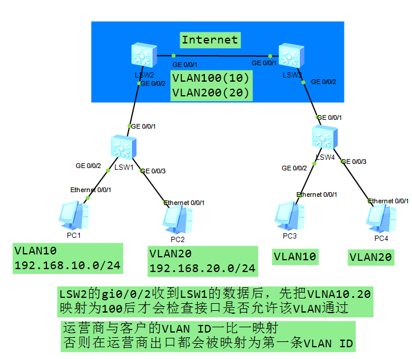
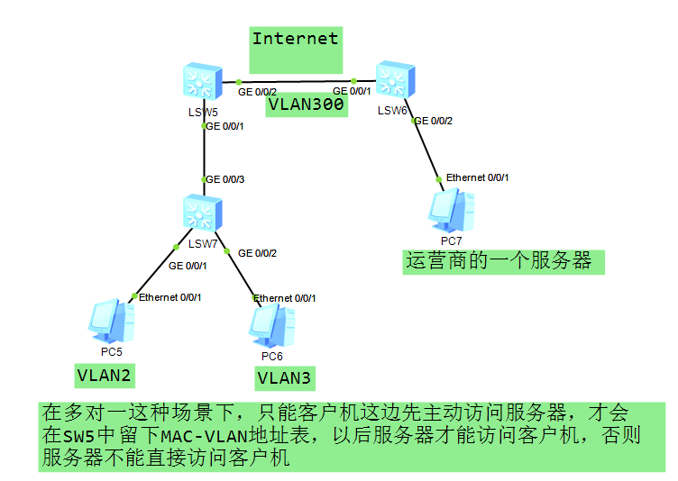

# VLAN-Mapping :id=vlan-mapping

------------

## 定义 :id=def

VLAN Mapping 通过修改报文携带的 VLAN Tag 来实现不同 VLAN 的相互映射。

------------

## 目的 :id=aim

在某些场景中，两个 VLAN 相同的二层用户网络通过骨干网络互联，为了实现用户之间的二层互通，以及二层协议（例如 `MSTP` 等）的统一部署，需要实现两个用户网络的无缝连接，此时就需要骨干网可以传输来自用户网络的带有 VLAN Tag 的二层报文。而在通常情况下，骨干网的 VLAN 规划和用户网络的 VLAN 规划是不一致的，所以在骨干网中无法直接传输用户网络的带有 VLAN Tag 的二层报文。

解决这个问题的方法有两个，其中一个是通过 `QinQ` 或者 `VPLS` 等二层隧道技术，将用户带有 VLAN Tag 的二层报文封装在骨干网报文中进行传输，可以实现用户带有 VLAN Tag 的二层报文的透传。但是这种方法一方面需要增加额外的报文开销（增加一层封装），另外一方面，二层隧道技术可能会对某些二层协议报文的透传支持不是非常完善。另外一种方法就是通过 VLAN Mapping 技术，一侧用户网络的带有 VLAN Tag 的二层报文进入骨干网后，骨干网边缘设备将用户网络的 VLAN（C-VLAN）修改为骨干网中可以识别和承载的 VLAN（S-VLAN），传输到另一侧之后，边缘设备再将 S-VLAN 修改为 C-VLAN。这样就可以很好的实现两个用户网络二层无缝连接。

在另一种场景中，如果由于规划的差异，导致两个直接相连的二层网络中部署的 VLAN ID 不一致。但是用户又希望可以把两个网络作为单个二层网络进行统一管理，例如用户二层互通和二层协议的统一部署。此时也可以在连接两个网络的交换机上部署 VLAN Mapping 功能，实现两个网络之间不同 VLAN ID 的映射，达到二层互通和统一管理的目的。

​ 路由器收到带 Tag 的数据报文后，根据配置的 VLAN Mapping 方式，决定替换外层 Tag 中的 VLAN ID 或优先级；然后进入 MAC 地址学习阶段，根据源 MAC 地址 + 映射后的 VLAN ID 刷新 MAC 地址表项；根据目的 MAC + 映射后 VLAN ID 查找 MAC 地址表项，如果没有找到，则在 VLAN ID 对应的 VLAN 内广播，否则从表项对应的接口转发。

---

## 实现方式 :id=implementation

**设备支持基于 VLAN ID 和 802.1p 优先级实现 VLAN Mapping。**

*   基于 VLAN ID
    
    当部署 VLAN Mapping 功能设备上的接口收到带有单层 VLAN Tag 的报文时，将单层报文所携带的 VLAN ID 替换为新的 VLAN ID。
    
    当部署 VLAN Mapping 功能设备上的接口收到带有两层 VLAN Tag 的报文时，将两层报文携带的外层 Tag 替换为新的 VLAN Tag，内层 Tag 作为数据透传。
    
*   基于 802.1p 优先级
    
    当部署 VLAN Mapping 功能设备上的接口收到带有单层 VLAN Tag 的报文时，将单层报文所携带的 802.1p 优先级替换为新的 802.1p 优先级。
    
    当部署 VLAN Mapping 功能设备上的接口收到带有两层 VLAN Tag 的报文时，将两层报文所携带的外层 802.1p 优先级替换为新的 802.1p 优先级。
    
---

## 需求 :id=demand
如下图所示，客户有两个区，配置有 VLNA 10 20，现在需要通过运营商网络进行传递。运营商网络中也有自己的 VLAN，所以通过 VLAN-Mapping 映射，以实现客户两端的通信。

图：基于 VLAN ID 配置 VLAN-Mapping 拓扑

---

## 多对一情景下的情况 :id=n21

如下图，客户这边有多个属于不同 VLAN 的主机，运营商那边有一台服务器。PC5 处于 VLAN2，PC6 处于 VLAN3，在 LSW5 进行了 VLAN-Mapping ，将 VLAN2,3 映射为 VLAN300。LSW6 可以接收 VLAN300 的数据，所以 PC7 可以收到数据。但是在通信过程中，只能客户机先主动访问服务器，在 SW5 中留下 MAC-VLAN 地址表后，以后服务器才可访问客户机，否则服务器不能直接访问客户机。

图：多对一的情景

