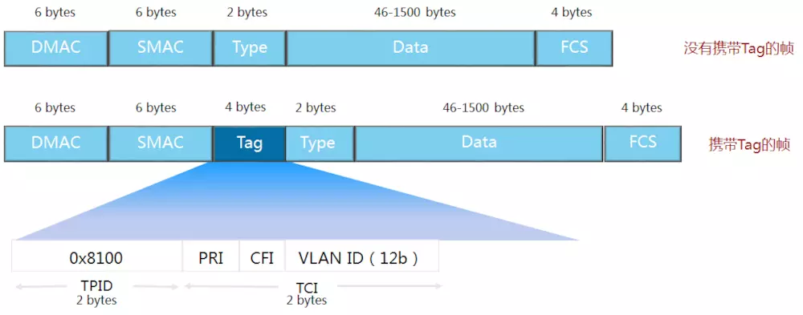
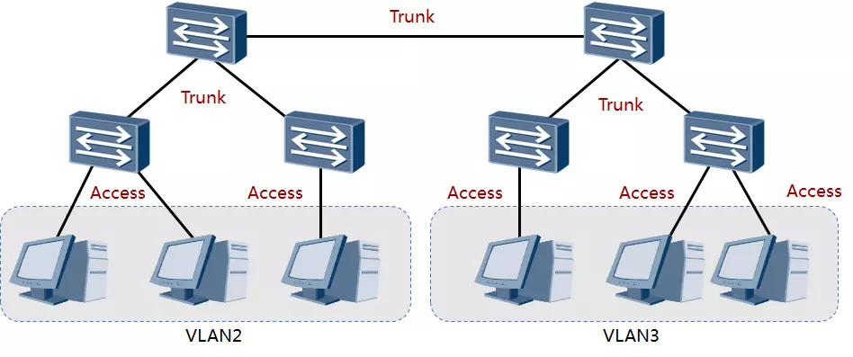
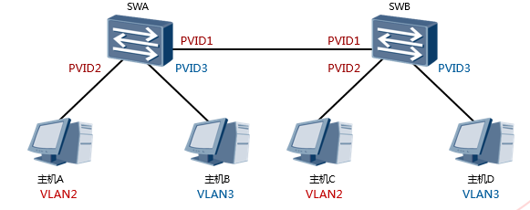
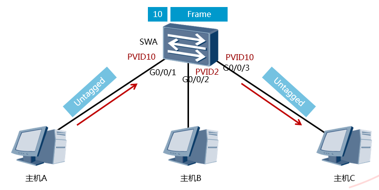
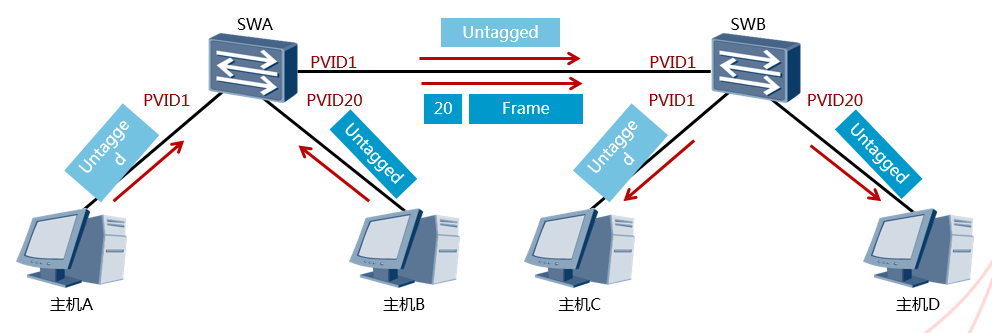
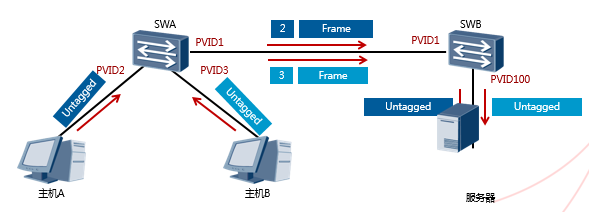
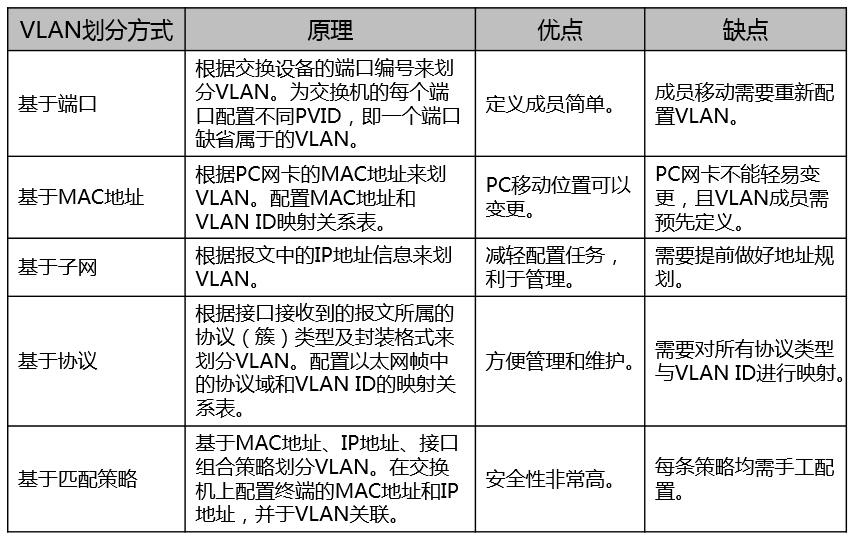

# VLAN :id=vlan

虚拟局域网（VLAN）是一组逻辑上的设备和用户，这些设备和用户并不受物理位置的限制，可以根据功能、部门及应用等因素将它们组织起来，相互之间的通信就好像它们在同一个网段中一样，由此得名虚拟局域网。一个VLAN就是一个广播域，VLAN之间的通信是通过第3层的路由器来完成的。

VLAN的作用：隔离广播域；在二层对数据进行隔离、转发。

---

## VLAN Tag :id=vlan-tag

* IEEE 802.1Q

  * IEEE 802.1Q是虚拟桥接局域网的正式标准，对Ethernet帧格式进行了修改，在源MAC地址字段和协议类型字段之间加入4字节的802.1Q Tag。

* 802.1q Tag各字段含义

  * TPID：长度为2字节，表示帧类型。取值为0x8100时表示802.1q Tag帧。
  * PRI：Priority，长度为3比特，表示帧的优先级，取值范围为0～7，值越大优先级越高。一般情况下，当交换机部署QoS时，优先发送优先级高的数据帧。
  * CFI：Canonical Format Indicator，长度为1比特，表示MAC地址是否是经典格式。CFI为0说明是经典格式，CFI为1表示为非经典格式。用于区分以太网帧、FDDI（Fiber Distributed Digital Interface）帧和令牌环网帧。在以太网中，CFI的值为0。
  * VID：VLAN ID，长度为12比特，表示该帧所属的VLAN。

---

## VLAN 链路类型 :id=vlan-link

* 接入链路（Access Link）

  * 常用作连接用户主机和交换机的链路。通常情况下，主机并不需要知道自己属于哪个VLAN，主机硬件通常也不能识别带有VLAN标记的帧。因此，主机发送和接收的帧都是untagged帧。

* 干道链路（Trunk Link）

  * 常用作连接交换机与交换机或交换机与路由器之间的链路。干道链路可以承载多个不同VLAN数据，数据帧在干道链路传输时，干道链路的两端设备需要能够识别数据帧属于哪个VLAN，所以在干道链路上，一般传输的帧都是Tagged帧。

* 拓扑描述

  * 对于主机来说，它不需要知道VLAN的存在。主机发出的是untagged报文。
  * 交换设备接收到报文后，根据配置规则（如端口信息）判断报文所属的VLAN后，再进行处理。
  * 如果报文需要通过另一台交换机转发，则该报文必须通过干道链路传输到对端交换设备上。为了保证其它交换设备能够正确处理报文中的VLAN信息，在干道链路上传输的报文一般均打上了VLAN标记。
  * 当交换设备最终确定报文出端口后，将报文发送给主机前，需要将VLAN标记从帧中删除，这样主机接收到的报文都是不带VLAN 标记的以太网帧。

---

## 缺省VID(PVID) :id=pvid

*   PVID 表示端口在缺省情况下所属的 VLAN。
*   缺省情况下，交换机每个端口的 PVID 都是 1。

*   PVID 即 Port VLAN ID 思科叫做本征 Vlan。
*   代表端口的缺省 VLAN。交换机从对端设备收到的帧有可能是 Untagged 的数据帧，但所有以太网帧在交换机中都是以 Tagged 的形式来被处理和转发的，因此交换机必须给端口收到的 Untagged 数据帧添加上 Tag。为了实现此目的，必须为交换机配置端口的缺省 VLAN。当该端口收到 Untagged 数据帧时，交换机将给它加上该缺省 VLAN 的 VLAN Tag。

---

## VLAN 端口类型 :id=port-type

端口类型用于识别 VLAN 帧，每种端口类型均可配置一个缺省 VLAN

### Access 端口 :id=access-port

Access 端口是交换机上用来连接用户主机的端口，它只能连接接入链路，并且只能允许唯一的 VLAN ID 通过本端口。

*   Access 端口收发数据帧的规则如下：
    1.  如果该端口收到对端设备发送的帧是 untagged（不带 VLAN 标签），交换机将强制加上该端口的 PVID。如果该端口收到对端设备发送的帧是 tagged（带 VLAN 标签），交换机会检查该标签内的 VLAN ID。当 VLAN ID 与该端口的 PVID 相同时，接收该报文。当 VLAN ID 与该端口的 PVID 不同时，丢弃该报文。
    2.  Access 端口发送数据帧时，总是先剥离帧的 Tag，然后再发送。Access 端口发往对端设备的以太网帧永远是不带标签的帧。
*   在本示例中，交换机的 G0/0/1，G0/0/2，G0/0/3 端口分别连接三台主机，都配置为 Access 端口。主机 A 把数据帧（未加标签）发送到交换机的 G0/0/1 端口，再由交换机发往其他目的地。收到数据帧之后，交换机根据端口的 PVID 给数据帧打上 VLAN 标签 10，然后决定从 G0/0/3 端口转发数据帧。G0/0/3 端口的 PVID 也是 10，与 VLAN 标签中的 VLAN ID 相同，交换机移除标签，把数据帧发送到主机 C。连接主机 B 的端口的 PVID 是 2，与 VLAN10 不属于同一个 VLAN，因此此端口不会接收到 VLAN10 的数据帧。

### Trunk 端口 :id=trunk-port

Trunk 端口是交换机上用来和其他交换机连接的端口，它只能连接干道链路。Trunk 端口允许多个 VLAN 的帧（带 Tag 标记）通过。

*   Trunk 端口收发数据帧的规则如下：
    1.  当接收到对端设备发送的不带 Tag 的数据帧时，会添加该端口的 PVID，如果 PVID 在允许通过的 VLAN ID 列表中，则接收该报文，否则丢弃该报文。当接收到对端设备发送的带 Tag 的数据帧时，检查 VLAN ID 是否在允许通过的 VLAN ID 列表中。如果 VLAN ID 在接口允许通过的 VLAN ID 列表中，则接收该报文。否则丢弃该报文。
    2.  端口发送数据帧时，当 VLAN ID 与端口的 PVID 相同，且是该端口允许通过的 VLAN ID 时，去掉 Tag，发送该报文。当 VLAN ID 与端口的 PVID 不同，且是该端口允许通过的 VLAN ID 时，保持原有 Tag，发送该报文。
*   在本示例中，SWA 和 SWB 连接主机的端口为 Access 端口，PVID 如图所示。SWA 和 SWB 互连的端口为 Trunk 端口，PVID 都为 1，此 Trunk 链路允许所有 VLAN 的流量通过。当 SWA 转发 VLAN1 的数据帧时会剥离 VLAN 标签，然后发送到 Trunk 链路上。而在转发 VLAN20 的数据帧时，不剥离 VLAN 标签直接转发到 Trunk 链路上。

### Hybrid 端口 :id=hybrid-port

*   Hybrid 端口是交换机上既可以连接用户主机，又可以连接其他交换机的端口。Hybrid 端口既可以连接接入链路又可以连接干道链路。Hybrid 端口允许多个 VLAN 的帧通过，并可以在出端口方向将某些 VLAN 帧的 Tag 剥掉。华为设备默认的端口类型是 Hybrid。
*   Hybrid 端口收发数据帧的规则如下：
    1.  当接收到对端设备发送的不带 Tag 的数据帧时，会添加该端口的 PVID，如果 PVID 在允许通过的 VLAN ID 列表中，则接收该报文，否则丢弃该报文。当接收到对端设备发送的带 Tag 的数据帧时，检查 VLAN ID 是否在允许通过的 VLAN ID 列表中。如果 VLAN ID 在接口允许通过的 VLAN ID 列表中，则接收该报文，否则丢弃该报文。
    2.  Hybrid 端口发送数据帧时，将检查该接口是否允许该 VLAN 数据帧通过。如果允许通过，则可以通过命令配置发送时是否携带 Tag。
*   在本示例中，要求主机 A 和主机 B 都能访问服务器，但是它们之间不能互相访问。此时交换机连接主机和服务器的端口，以及交换机互连的端口都配置为 Hybrid 类型。交换机连接主机 A 的端口的 PVID 是 2，连接主机 B 的端口的 PVID 是 3，连接服务器的端口的 PVID 是 100。

---

## VLAN 划分 :id=vlan-assign

### VLAN 划分方法 :id=vlan-assign-method

*   基于端口划分 VLAN
    *   根据交换设备的端口编号来划分 VLAN。
    *   网络管理员给交换机的每个端口配置不同的 PVID，即一个端口缺省属于的 VLAN。
    *   当一个数据帧进入交换机端口时，如果没有带 VLAN 标签，且该端口上配置了 PVID，那么，该数据帧就会被打上端口的 PVID。
    *   如果进入的帧已经带有 VLAN 标签，那么交换机不会再增加 VLAN 标签，对 VLAN 帧的处理由端口类型决定。
*   基于 MAC 地址划分 VLAN
    *   根据计算机网卡的 MAC 地址来划分 VLAN。
    *   网络管理员成功配置 MAC 地址和 VLAN ID 映射关系表，如果交换机收到的是 untagged（不带 VLAN 标签）帧，则依据该表添加 VLAN ID。
*   基于子网划分 VLAN
    *   如果交换设备收到的是 untagged（不带 VLAN 标签）帧，交换设备根据报文中的 IP 地址信息，确定添加的 VLAN ID。
*   基于协议划分 VLAN
    *   根据接口接收到的报文所属的协议（族）类型及封装格式来给报文分配不同的 VLAN ID。网络管理员需要配置以太网帧中的协议域和 VLAN ID 的映射关系表，如果收到的是 untagged（不带 VLAN 标签）帧，则依据该表添加 VLAN ID。
    *   目前，支持划分 VLAN 的协议有 IPV4、IPV6、IPX、AppleTalk（AT），封装格式有 Ethernet II、802.3 raw、802.2 LLC、802.2 SNAP。
*   基于匹配策略划分 VLAN(`VCAP`)
    *   基于 MAC 地址、IP 地址、接口组合策略划分 VLAN 是指在交换机上配置终端的 MAC 地址和 IP 地址，并与 VLAN 关联。只有符合条件的终端才能加入指定 VLAN。符合策略的终端加入指定 VLAN 后，严禁修改 IP 地址或 MAC 地址，否则会导致终端从指定 VLAN 中退出。

### VLAN 划分匹配优先级 :id=vlan-assign-priority

*   基于匹配策略 > 基于 MAC 地址和基于子网 > 基于协议 > 基于端口
*   基于 MAC 地址和基于子网拥有相同的优先级
    *   可以通过命令改变基于 MAC 地址划分 VLAN 和基于子网划分 VLAN 的优先级，从而决定优先划分 VLAN 的方式。
*   基于端口的优先级最低，却是最常用的 VLAN 划分方式。
*   基于匹配策略的优先级最高，却是最不常用的 VLAN 划分方式。

---

## QINQ :id=qinq

随着以太网技术在网络中的大量部署，利用802.1Q VLAN对用户进行隔离和标识受到很大限制。因为IEEE802.1Q中定义的VLAN Tag域只有12个比特，仅能表示4096个VLAN，无法满足以太网中标识大量用户的需求，于是QinQ技术应运而生。

QinQ（802.1Q-in-802.1Q）技术是一项扩展VLAN空间的技术，通过在802.1Q标签报文的基础上再增加一层802.1Q的Tag来达到扩展VLAN空间的功能，可以使私网VLAN透传公网。由于在骨干网中传递的报文有两层802.1Q Tag（一层公网Tag，一层私网Tag），即802.1Q-in-802.1Q，所以称之为QinQ协议。

>https://happymiki.github.io/2018/08/07/VLAN/