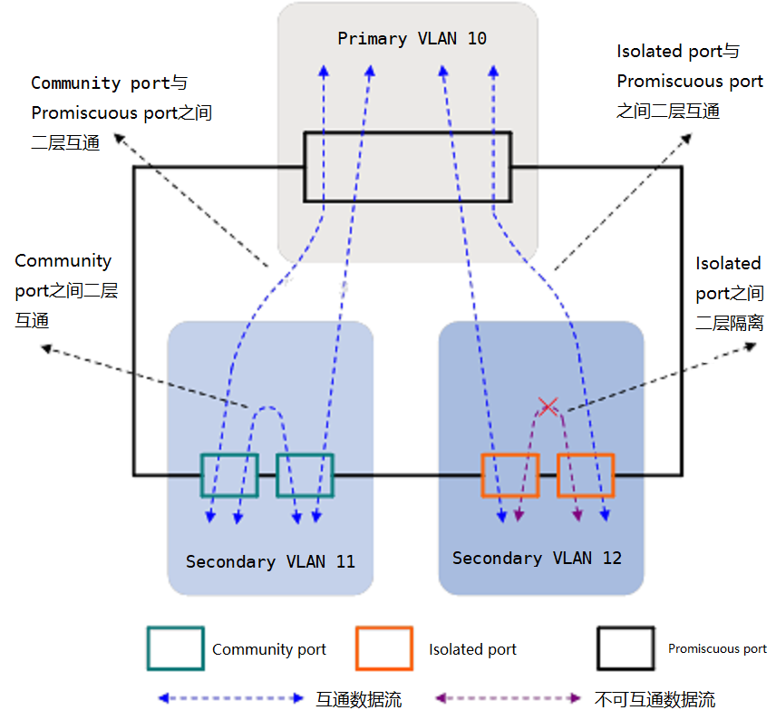

# VLAN

把一个LAN划分成多个逻辑的VLAN，每个VLAN是一个广播域，VLAN内的主机间通信就和在一个LAN内一样，而VLAN间则不能直接互通，这样，广播报文就被限制在一个VLAN内。

---

## 1. VLAN Tag

IEEE 802.1Q协议规定，在以太网数据帧的目的MAC地址和源MAC地址字段之后、协议类型字段之前加入4个字节的VLAN标签（又称VLAN Tag，简称Tag），用以标识VLAN信息。

* 802.1q Tag各字段含义

  * TPID：长度为2字节，表示帧类型。取值为0x8100时表示802.1q Tag帧。
  * PRI：Priority，长度为3比特，表示帧的优先级，取值范围为0～7，值越大优先级越高。一般情况下，当交换机部署QoS时，优先发送优先级高的数据帧。
  * CFI：Canonical Format Indicator，长度为1比特，表示MAC地址是否是经典格式。CFI为0说明是经典格式，CFI为1表示为非经典格式。用于区分以太网帧、FDDI（Fiber Distributed Digital Interface）帧和令牌环网帧。在以太网中，CFI的值为0。
  * VID：VLAN ID，长度为12比特，表示该帧所属的VLAN。由于0和4095为协议保留取值，所以VLAN ID的有效取值范围是1～4094。
  

在一个VLAN交换网络中，以太网帧主要有以下两种形式：

  - 有标记帧（Tagged帧）：加入了4字节VLAN标签的帧。
  - 无标记帧（Untagged帧）：原始的、未加入4字节VLAN标签的帧。

---

## 2. PVID/NativeVlan

缺省VLAN又称PVID（Port Default VLAN ID）。前面提到，交换机处理的数据帧都带Tag，当交换机收到Untagged帧时，就需要给该帧添加Tag，添加什么Tag，就由接口上的缺省VLAN决定。它的具体作用是：

  - 当接口接收数据帧时，如果接口收到一个Untagged帧，交换机会根据PVID给此数据帧添加等于PVID的Tag，然后再交给交换机内部处理；如果接口收到一个Tagged帧，交换机则不会再给该帧添加接口上PVID对应的Tag。
  - 当接口发送数据帧时，如果发现此数据帧的Tag的VID值与PVID相同，则交换机会将Tag去掉，然后再从此接口发送出去。

每个接口都有一个缺省VLAN, 默认为vlan 1。

---

## 3. VLAN 分配

为了提高处理效率，交换机内部处理的数据帧一律都是Tagged帧。

当端口收到untagged帧时，则需要为其分配vlan tag。

- 基于流 (高优先级)
  acl匹配特定流量，进行vlan分配
- vlan翻译
- 基于smac
- 基于sip掩码
- 基于协议
  - FrameType
    EthernetII, IEEE 802.3 SNAP, IEEE 802.3 LLC
  - EtherType
    IPV4, IPX-RAW, IPX-LLC等
- 基于端口 (低优先级, 默认)

---

## 4. VLAN 检查

只有允许的vlan能通过端口，包括入方向和出方向。

端口以tagged 或者 untagged 方式加入vlan, 这些vlan则为端口允许通过的vlan。

若端口以tagged加入vlan, 则端口发送报文不会剥离vlan tag。

若端口以untagged 加入 vlan, 则端口发送报文会剥离vlan tag。

### 4.1 Access 端口

Access 端口是交换机上用来连接用户主机的端口，以untagged方式加入pvid。

### 4.2 Trunk 端口

Trunk 端口是交换机上用来和其他交换机连接的端口。以tagged方式加入多个vlan;若要加入pvid, 以untagged方式加入。

### 4.3 Hybrid 端口

Hybrid 端口是交换机上既可以连接用户主机，又可以连接其他交换机的端口。以untagged加入多个vlan, 以tagged vlan加入多个vlan。

---

## 5. QINQ

因为IEEE802.1Q中定义的VLAN Tag域只有12个比特，仅能表示4096个VLAN，无法满足以太网中标识大量用户的需求，于是QinQ技术应运而生。

QinQ（802.1Q-in-802.1Q）通过在802.1Q标签报文的基础上再增加一层802.1Q的Tag来达到扩展VLAN空间的功能。

内层 VLAN Tag：为用户的私网 VLAN Tag，Customer VLAN Tag (简称 CVLAN)。设备依靠该 Tag 在私网中传送报文。

外层 VLAN Tag：为运营商分配给用户的公网 VLAN Tag， Service VLAN Tag(简称 SVLAN)。设备依靠该 Tag 在公网中传送 QinQ 报文。

---

## 6. IVL/SVL

Independent Vlan Learning: vlan间相互独立

Shared Vlan Learning: 多个vlan共享同一fid，使用mac+fid进行学习和转发

---

## 7. Private Vlan

为什么要有PVLAN: 隔离hosts, 通常需要给每个隔离host分配不同vlan和ip子网, 浪费资源。

Pvlan 可以将一个 vlan 的二层广播域划分成多个子域, 子域由一对 vlan 组成即主 vlan 和次要vlan 组成。

单个PVLAN 中只有一个主 vlan ,每个子域有不同的次要 vlan, 实现二层网络的隔离。主vlan与次要vlan能相互通信。

次要 vlan 包括隔离 vlan 和团体 vlan。

单个PVLAN中只有一个隔离VLAN，隔离 vlan中的端口互相不能进行二层通信,也不能与其他团体vlan通信。

单个PVLAN中可以有多个团体vlan, 单个团体 vlan 内的端口可以进行二层交换，但不能与其他团体vlan二层通信。

## 8. 三层路由

目前的三层交换机一般是通过VLAN来划分二层网络并实现二层交换，同时能够实现不同VLAN间的三层IP互访。不同网络的主机之间互访的流程简要如下：

- 源主机在发起通信之前，将自己的IP与目的主机的IP进行比较 
  - 如果两者位于同一网段（用网络掩码计算后具有相同的网络号），那么源主机直接向目的主机发送ARP请求，在收到目的主机的ARP应答后获得对方的物理层（MAC）地址，然后用对方MAC地址作为报文的目的MAC地址进行报文发送。
  - 当源主机判断目的主机与自己位于不同网段时，它会通过网关（Gateway）来递交报文，即发送ARP请求来获取网关IP地址对应的MAC，在得到网关的ARP应答后，用网关MAC作为报文的目的MAC发送报文。此时发送报文的源IP是源主机的IP，目的IP仍然是目的主机的IP。
  
下面详细介绍一下三层交换的过程。

如图所示，通信的源、目的主机连接在同一台三层交换机上，但它们位于不同VLAN（网段）。对于三层交换机来说，这两台主机都位于它的直连网段内，它们的IP对应的路由都是直连路由。

图中标明了两台主机的MAC、IP地址、网关，以及三层交换机的MAC、不同VLAN配置的三层接口IP。当 PC A向PC B发起PING时，流程如下：（假设三层交换机上还未建立任何硬件转发表项）

- 根据前面的描述，PC_A首先检查出目的IP地址 `10.2.1.2`（PC_B）与自己不在同一网段，因此它发出请求网关地址10.1.1.1对应MAC的ARP请求；
- L3 Switch收到PC A的ARP请求后，检查请求报文发现被请求IP是自己的三层接口IP，因此发送ARP应答并将自己的三层接口MAC（MAC Switch）包含在其中。同时它还会把PC A的IP地址与MAC地址对应（10.1.1.2与MAC A）关系记录到自己的ARP表项中去（因为ARP请求报文中包含了发送者的IP和MAC）；
- PC A得到网关（L3 Switch）的ARP应答后，组装ICMP请求报文并发送，报文的目的MAC（即DMAC）＝MAC Switch、源MAC（即SMAC）＝MAC A、源IP（即SIP）＝10.1.1.2、目的IP（即DIP）＝10.2.1.2；
- L3 Switch收到报文后，首先根据报文的源MAC+VLAN ID更新MAC表。然后，根据报文的目的MAC＋VLAN ID查找MAC地址表，发现匹配了自己三层接口MAC的表项，说明需要作三层转发，于是继续查找交换芯片的三层表项；
- 交换芯片根据报文的目的IP去查找其三层表项，由于之前未建立任何表项，因此查找失败，于是将报文送到CPU去进行软件处理；
- CPU根据报文的目的IP去查找其软件路由表，发现匹配了一个直连网段（PC B对应的网段），于是继续查找其软件ARP表，仍然查找失败。然后L3 Switch会在目的网段对应的VLAN 3的所有接口发送请求地址10.2.1.2对应MAC的ARP请求；
- PC B收到L3 Switch发送的ARP请求后，检查发现被请求IP是自己的IP，因此发送ARP应答并将自己的MAC（MAC B）包含在其中。同时，将L3 Switch的IP与MAC的对应关系（10.2.1.1与MAC Switch）记录到自己的ARP表中去；
- L3 Switch收到PC B的ARP应答后，将其IP和MAC对应关系（10.2.1.2与MAC B）记录到自己的ARP表中去，并将PC A的ICMP请求报文发送给PC B，报文的目的MAC修改为PC B的MAC（MAC B），源MAC修改为自己的MAC（MAC Switch）。同时，在交换芯片的三层表项中根据刚得到的三层转发信息添加表项（内容包括IP、MAC、出口VLAN、出接口），这样后续的PC A发往PC B的报文就可以通过该硬件三层表项直接转发了；
- PC B收到L3 Switch转发过来的ICMP请求报文以后，回应ICMP应答给PC A。ICMP应答报文的转发过程与前面类似，只是由于L3 Switch在之前已经得到PC A的IP和MAC对应关系了，也同时在交换芯片中添加了相关三层表项，因此这个报文直接由交换芯片硬件转发给PC A；
- 这样，后续的往返报文都经过查MAC表到查三层转发表的过程由交换芯片直接进行硬件转发了。

从上述流程可以看出，三层交换机正是充分利用了“一次路由（首包CPU转发并建立三层硬件表项）、多次交换（后续包芯片硬件转发）”的原理实现了转发性能与三层交换的完美统一。 

---

参考文章：
- https://happymiki.github.io/2018/08/07/VLAN/
- https://www.certprepare.com/private-vlan
- https://support.huawei.com/enterprise/zh/doc